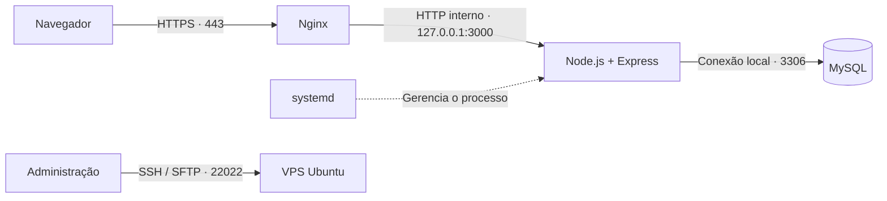

# Follow-up de processos — aplicação web e implantação em VPS

Aplicação multiusuário para acompanhamento de processos de importação, com cadastro de clientes, atualização de status, histórico de alterações e emissão de relatórios em PDF.

Este projeto reúne a aplicação e a documentação de sua implantação em uma VPS Linux: preparação do ambiente, configuração do MySQL, execução contínua com systemd, publicação por Nginx e acesso seguro por HTTPS. A infraestrutura foi organizada sem dependência de painel de hospedagem.

## Contexto e objetivo

O sistema centraliza referências de processos, fornecedores, produtos, datas de embarque e chegada, freetime, câmbio e observações. Os usuários trabalham sobre uma base compartilhada e acompanham as alterações pela interface web.

O objetivo da implantação foi disponibilizar esse ambiente em um subdomínio próprio, com persistência em banco relacional, controle de acesso e reinício automático do processo da aplicação em caso de falha.

## Funcionalidades

- Cadastro, edição e exclusão de clientes e processos.
- Salvamento automático dos campos editáveis.
- Consulta de alterações a cada cinco segundos para sincronização entre usuários.
- Histórico de alterações de campos, com autor, data e valores anterior e novo.
- Relatórios por cliente em PDF, gerados no navegador.
- Autenticação e perfis de administrador e usuário.
- Administração de contas, troca de senhas e desativação de usuários.
- Exportação de clientes e processos em JSON pelo administrador.

Todos os usuários autenticados acessam a mesma base de clientes. O perfil de administrador acrescenta a gestão de contas e a exportação de dados; não há separação de acesso por cliente.

## Tecnologias

| Camada | Tecnologia | Responsabilidade |
| --- | --- | --- |
| Interface | HTML, CSS e JavaScript | Navegação, formulários e comunicação com a API |
| Backend | Node.js 24 e Express 4 | API HTTP, autenticação e arquivos estáticos |
| Persistência | MySQL 8 e mysql2 | Dados, transações e histórico |
| Autenticação | bcryptjs, jsonwebtoken e cookie-parser | Hash de senhas e sessões em cookie |
| Controle de tentativas | express-rate-limit | Limitação das requisições de login |
| Relatórios | jsPDF e AutoTable | Construção e download do PDF no navegador |
| Sistema operacional | Ubuntu Server 22.04 LTS | Ambiente utilizado na implantação |
| Serviço da aplicação | systemd | Inicialização no boot, reinício após falhas e logs |
| Publicação | Nginx | Proxy reverso e terminação HTTPS |
| Certificado | Let's Encrypt e Certbot | Emissão e renovação do certificado TLS |
| Rede | UFW, SSH e SFTP | Controle de portas e administração remota |

## Arquitetura



O Nginx recebe as requisições públicas e encaminha a navegação e as chamadas à API para o Express. O banco permanece na própria VPS. O firewall permite as portas de administração e publicação, mantendo o acesso direto à aplicação e ao MySQL bloqueado externamente.

A atualização entre usuários utiliza consultas periódicas ao contador de revisão do banco. Não há dependência de WebSocket. Em alterações simultâneas no mesmo campo, prevalece a última gravação.

## Estrutura do projeto

```text
.
├── README.md
├── .env.example
├── .gitignore
├── package.json
├── package-lock.json
├── server.js
├── db.js
└── public/
    ├── index.html
    ├── app.js
    ├── app.css
    ├── logo.png
    └── vendor/
        ├── jspdf.umd.min.js
        └── jspdf.plugin.autotable.min.js
```

O arquivo `server.js` concentra as rotas e o servidor HTTP. O `db.js` define a conexão, a estrutura inicial do banco e a criação do primeiro administrador. A pasta `public/` contém os arquivos entregues ao navegador.

## Implantação — etapas 1 a 13

O roteiro descreve uma instalação nova em VPS dedicada ao projeto. Para servidores que já hospedam outros sistemas, as configurações devem ser integradas aos serviços existentes.

Os comandos Linux são executados na VPS por SSH, usando PuTTY ou outro cliente. Comandos PowerShell são executados no computador Windows. Os exemplos usam `sistema.exemplo.com.br`, `IP_DA_VPS` e `USUARIO_SSH`, que devem ser substituídos pelos valores do ambiente.

### 1. Definição do ambiente de hospedagem

Foi adotada uma VPS Linux com acesso administrativo por SSH, permitindo gerenciar os serviços necessários à aplicação. O cPanel não é um requisito.

A publicação utiliza um subdomínio dedicado. A aplicação trabalha com caminhos absolutos, como `/api`, `/app.js` e `/logo.png`; hospedá-la em um subdiretório exigiria adaptar esses caminhos.

### 2. Levantamento dos requisitos da aplicação

A análise dos arquivos definiu os requisitos da infraestrutura:

- Um processo Node.js atende a interface e a API.
- O projeto não possui etapa de build; a execução começa em `server.js`.
- O banco e o usuário MySQL precisam existir antes da primeira inicialização.
- As cinco tabelas são criadas automaticamente: `users`, `clients`, `processes`, `process_log` e `meta`.
- Os PDFs são processados no navegador, utilizando as bibliotecas em `public/vendor/`.
- As configurações são fornecidas por variáveis de ambiente.

Embora `package.json` declare Node.js `>=18`, a implantação utiliza Node.js 24, compatível com o carregamento de `.env` feito por `process.loadEnvFile()`.

### 3. Preparação da VPS e dos acessos

O ambiente de referência utiliza Ubuntu Server 22.04 LTS, Node.js 24 e MySQL 8. Como estimativa inicial para aplicação e banco no mesmo servidor, considera-se:

| Recurso | Referência inicial |
| --- | --- |
| CPU | 2 vCPU |
| Memória | 4 GB de RAM |
| Armazenamento | 40 GB de SSD ou superior |
| Administração | SSH com permissão root ou sudo |
| Publicação | Domínio ou subdomínio com acesso à gestão de DNS |

Esse dimensionamento é uma referência de implantação, não uma capacidade comprovada por teste de carga.

O acesso SSH deste roteiro utiliza a porta `22022`. Ela deve corresponder à configuração real do servidor; os comandos abaixo não alteram a porta do serviço SSH.

```powershell
ssh -p 22022 USUARIO_SSH@IP_DA_VPS
```

No PuTTY, informe o mesmo endereço e porta. No WinSCP, utilize SFTP com as mesmas credenciais ou chave de acesso.

### 4. Configuração do DNS

No provedor responsável pelo DNS, crie o registro do subdomínio:

| Tipo | Nome | Destino |
| --- | --- | --- |
| A | `sistema` | IPv4 público da VPS |

Preserve os registros do site principal e dos serviços de e-mail. Se houver um registro AAAA para o subdomínio, ele também deverá apontar para a VPS corretamente.

Valide a resolução no Windows:

```powershell
Resolve-DnsName sistema.exemplo.com.br -Type A
```

A configuração considera acesso direto ao Nginx. Caso exista outro proxy ou CDN à frente da VPS, revise o tratamento de IP real e a confiança em proxies.

### 5. Instalação dos serviços

Confira o sistema operacional, atualize os pacotes e instale os componentes:

```bash
cat /etc/os-release
sudo apt update
sudo apt upgrade -y
sudo apt install -y curl ca-certificates gnupg unzip nginx mysql-server ufw nano snapd
sudo systemctl enable --now mysql nginx
```

Para instalar Node.js 24, este roteiro utiliza o repositório de terceiros NodeSource. Baixe e revise o instalador antes da execução:

```bash
curl -fsSL https://deb.nodesource.com/setup_24.x -o /tmp/followup-nodesource-setup.sh
less /tmp/followup-nodesource-setup.sh
sudo bash /tmp/followup-nodesource-setup.sh
sudo apt install -y nodejs
node --version
npm --version
command -v node
```

O executável utilizado na configuração do serviço é `/usr/bin/node`. Se a instalação retornar outro caminho, ajuste o serviço da etapa 10.

### 6. Configuração do firewall

Libere a porta SSH efetivamente utilizada antes de ativar o bloqueio de entrada. Neste ambiente, a administração utiliza `22022/TCP`:

```bash
sudo ufw default deny incoming
sudo ufw default allow outgoing
sudo ufw allow 22022/tcp
sudo ufw allow 80/tcp
sudo ufw allow 443/tcp
sudo ufw enable
sudo ufw status verbose
```

Mantenha a conexão atual aberta e confirme uma segunda sessão SSH. Caso o provedor tenha firewall próprio, aplique nele as permissões equivalentes.

As portas `3000`, `3306` e `33060` não devem receber conexões públicas. O código atual inicia o Node sem restringir explicitamente a interface de escuta, tornando o bloqueio externo da porta 3000 necessário neste desenho.

### 7. Criação do banco e do usuário MySQL

Entre no MySQL com privilégios administrativos:

```bash
sudo env MYSQL_HISTFILE=/dev/null mysql
```

Crie o banco e uma conta exclusiva para a aplicação. Substitua a senha antes de executar:

```sql
CREATE DATABASE followup
  CHARACTER SET utf8mb4
  COLLATE utf8mb4_unicode_ci;

CREATE USER 'followup_app'@'127.0.0.1'
  IDENTIFIED BY 'SUBSTITUA_POR_UMA_SENHA_FORTE';

GRANT SELECT, INSERT, UPDATE, DELETE, CREATE, REFERENCES
  ON followup.* TO 'followup_app'@'127.0.0.1';

EXIT;
```

As permissões atendem à criação inicial das tabelas e às operações do código atual. Teste o acesso por TCP:

```bash
mysql --protocol=TCP -h 127.0.0.1 -P 3306 -u followup_app -p followup -e "SELECT 1;"
```

O retorno esperado é uma tabela contendo `1`. Mantenha o MySQL vinculado à interface local, conferindo `bind-address = 127.0.0.1` em `/etc/mysql/mysql.conf.d/mysqld.cnf`; se existir `mysqlx-bind-address`, confira-o também. Reinicie o MySQL caso altere essa configuração.

### 8. Transferência dos arquivos e instalação das dependências

No PowerShell, a partir da pasta do projeto, crie um pacote contendo somente os arquivos necessários à execução:

```powershell
Compress-Archive -Path server.js,db.js,package.json,package-lock.json,public -DestinationPath followup-vps.zip -Force
scp -P 22022 .\followup-vps.zip USUARIO_SSH@IP_DA_VPS:~/followup-vps.zip
```

Também é possível enviar esse ZIP pelo WinSCP. O destino inicial é a pasta pessoal do usuário SSH. O diretório definitivo da aplicação será `/opt/followup`.

Na VPS, execute uma única vez a criação do usuário de serviço e extraia o pacote:

```bash
sudo useradd --system --user-group --home-dir /opt/followup --create-home --shell /usr/sbin/nologin followup
sudo unzip "$HOME/followup-vps.zip" -d /opt/followup
sudo chown -R followup:followup /opt/followup
sudo chmod 750 /opt/followup
sudo -u followup -H bash -c 'cd /opt/followup && npm ci --omit=dev'
```

O `server.js` e o `package.json` devem ficar diretamente em `/opt/followup`. O comando `npm ci` instala as versões registradas em `package-lock.json`.

### 9. Configuração das variáveis de ambiente

Gere uma chave para assinar as sessões:

```bash
node -e "console.log(require('crypto').randomBytes(48).toString('hex'))"
```

Crie ou edite o arquivo de configuração:

```bash
sudo touch /opt/followup/.env
sudo chown followup:followup /opt/followup/.env
sudo chmod 600 /opt/followup/.env
sudo nano /opt/followup/.env
```

Modelo de configuração:

```dotenv
NODE_ENV=production
PORT=3000

DB_HOST=127.0.0.1
DB_PORT=3306
DB_USER=followup_app
DB_PASSWORD="SUBSTITUA_PELA_SENHA_DO_MYSQL"
DB_NAME=followup

JWT_SECRET="SUBSTITUA_PELA_CHAVE_GERADA"

ADMIN_NAME="Administrador"
ADMIN_EMAIL="admin@exemplo.com.br"
ADMIN_PASSWORD="SUBSTITUA_POR_UMA_SENHA_DE_LOGIN"

SEED_DEMO=false
```

| Configuração | Comportamento |
| --- | --- |
| `DB_*` | Define a conexão com o banco |
| `JWT_SECRET` | Mantém a assinatura das sessões entre reinícios |
| `ADMIN_EMAIL` e `ADMIN_PASSWORD` | Criam o primeiro administrador somente quando não há usuários |
| `ADMIN_NAME` | Nome inicial da conta administrativa |
| `SEED_DEMO` | Permite criar exemplos quando a tabela de clientes está vazia |
| `PORT` | Porta HTTP interna da aplicação |

A senha inicial exige pelo menos oito caracteres; adote uma senha exclusiva e mais longa para produção. A chave de sessão deve permanecer estável entre publicações. Desativar `SEED_DEMO` não remove dados de exemplo já criados.

### 10. Execução contínua com systemd

Crie `/etc/systemd/system/followup.service`:

```bash
sudo nano /etc/systemd/system/followup.service
```

```ini
[Unit]
Description=Follow-up de processos
After=network.target mysql.service
Wants=mysql.service
StartLimitIntervalSec=0

[Service]
Type=simple
User=followup
Group=followup
WorkingDirectory=/opt/followup
ExecStart=/usr/bin/node --env-file=/opt/followup/.env /opt/followup/server.js
Restart=on-failure
RestartSec=5
Environment=NODE_ENV=production
UMask=0077
NoNewPrivileges=true
PrivateTmp=true
ProtectHome=true
ProtectSystem=strict

[Install]
WantedBy=multi-user.target
```

Ative o serviço e confira seu estado:

```bash
sudo systemctl daemon-reload
sudo systemctl enable --now followup
sudo systemctl status followup --no-pager
curl --fail http://127.0.0.1:3000/api/health
```

A resposta esperada é `{"ok":true}`. A rota executa uma consulta no MySQL antes de responder. Em caso de falha, consulte:

```bash
sudo journalctl -u followup -n 80 --no-pager
```

### 11. Publicação com Nginx

Crie `/etc/nginx/sites-available/followup`:

```bash
sudo nano /etc/nginx/sites-available/followup
```

```nginx
server {
    listen 80;
    listen [::]:80;
    server_name sistema.exemplo.com.br;

    access_log /var/log/nginx/followup.access.log;
    error_log /var/log/nginx/followup.error.log;

    location / {
        proxy_pass http://127.0.0.1:3000;
        proxy_http_version 1.1;
        proxy_set_header Host $host;
        proxy_set_header X-Real-IP $remote_addr;
        proxy_set_header X-Forwarded-For $remote_addr;
        proxy_set_header X-Forwarded-Proto $scheme;
        proxy_set_header Connection "";
        proxy_read_timeout 60s;
    }
}
```

O Express está configurado com `trust proxy = 1`, adequado à topologia com um único Nginx diretamente à frente da aplicação. Os cabeçalhos encaminhados permitem reconhecer o protocolo HTTPS e o IP usado pelo controle de tentativas de login.

Ative o site e valide a configuração:

```bash
sudo ln -s /etc/nginx/sites-available/followup /etc/nginx/sites-enabled/followup
sudo nginx -t
```

Se o vínculo já existir, confira seu destino em vez de recriá-lo. Após o teste passar sem conflitos, aplique:

```bash
sudo systemctl reload nginx
curl --fail -H 'Host: sistema.exemplo.com.br' http://127.0.0.1/api/health
```

O retorno deve ser `{"ok":true}`. A página deve abrir pelo subdomínio. O login público deve ser utilizado após a configuração de HTTPS.

### 12. Configuração de HTTPS

Com DNS e HTTP funcionando, salve uma cópia da configuração e instale o Certbot via Snap:

```bash
sudo cp -a /etc/nginx/sites-available/followup /etc/nginx/sites-available/followup.pre-https
sudo snap install --classic certbot
sudo /snap/bin/certbot --nginx --redirect -d sistema.exemplo.com.br
```

Este procedimento pressupõe que não exista outra instalação do Certbot por um método diferente. Informe o e-mail de contato e aceite os termos apresentados para emitir o certificado.

Valide o acesso e a renovação:

```bash
curl --fail https://sistema.exemplo.com.br/api/health
curl -I http://sistema.exemplo.com.br
sudo /snap/bin/certbot renew --dry-run
systemctl list-timers --all | grep -i certbot
```

O acesso HTTP deve redirecionar para HTTPS. O teste de renovação deve terminar com sucesso e o agendamento precisa estar ativo. Mantenha a porta 80 acessível para a validação HTTP utilizada pelo Certbot.

O TLS termina no Nginx; a aplicação continua atendendo internamente na porta 3000.

### 13. Primeiro acesso e validação funcional

Acesse o subdomínio por HTTPS e utilize o administrador definido no `.env`. A validação de entrega deve cobrir:

| Verificação | Resultado esperado |
| --- | --- |
| Certificado e redirecionamento | HTTPS válido e HTTP redirecionado |
| Saúde da aplicação | `/api/health` retorna `{"ok":true}` |
| Autenticação | Login e encerramento de sessão funcionam |
| Persistência | Alterações permanecem após recarregar a página |
| Sincronização | Outra sessão recebe atualizações em aproximadamente cinco segundos |
| Histórico | Alterações de campos apresentam autor, data e valores |
| Relatório | PDF é gerado com os dados do cliente e os processos |
| Administração | Criação de contas, troca de senha e desativação funcionam |
| Reinicialização | Serviço retorna após reiniciar a VPS em janela de manutenção |
| Portas internas | 3000 e 3306 permanecem inacessíveis pela internet |

Depois de confirmar a criação do administrador, remova `ADMIN_PASSWORD` do `.env` e reinicie o serviço:

```bash
sudo nano /opt/followup/.env
sudo systemctl restart followup
```

A conta permanece no banco. Alterações posteriores de senha são feitas pela interface; modificar `ADMIN_PASSWORD` não redefine contas existentes.

## Decisões técnicas e limites do projeto

- **Um serviço para interface e API:** simplifica a publicação e mantém as requisições na mesma origem.
- **Banco local:** permite restringir o MySQL ao ambiente interno da VPS.
- **Usuário de serviço dedicado:** a aplicação executa sem privilégios de root.
- **Sessão em cookie:** usa `HttpOnly`, `SameSite=Lax` e `Secure` quando a requisição é reconhecida como HTTPS.
- **Persistência transacional:** as alterações de dados e o contador de revisão são tratados em transações.
- **Relatórios no navegador:** a geração de PDF não exige processamento adicional no servidor.

O histórico cobre alterações de campos de processos, não todas as ações do sistema. A exclusão de um processo também remove seu histórico associado. O JSON exportado pela interface não inclui usuários nem o histórico completo e não substitui um backup SQL.

Não há migração automática de estrutura para tabelas existentes, recuperação de senha por e-mail ou isolamento de clientes por usuário. A configuração de autenticação SSH por chave e a rotina de backup externo devem ser tratadas como atividades de operação, além das treze etapas deste roteiro.

## Resultado da implantação

A implantação deste projeto alcançou execução da aplicação com conexão MySQL, publicação por subdomínio e acesso HTTPS. O procedimento também permitiu identificar e resolver diferenças entre a página padrão do Nginx e o encaminhamento correto para o backend.

O trabalho documenta competências de administração Linux, controle de acesso a serviços, configuração de banco relacional, gestão de processos, DNS, proxy reverso e certificados TLS. O roteiro de validação funcional permanece como referência para novas instalações; não representa uma suíte automatizada de testes ou uma medição de desempenho.

## Publicação do repositório

Os comandos deste README usam valores de exemplo. Credenciais, chaves privadas, dumps com dados reais e pacotes de implantação devem permanecer fora do repositório. O `.gitignore` inclui exclusões para os arquivos operacionais locais; ele não remove arquivos de um histórico Git já publicado.

Para uma apresentação pública, revise também os dados de demonstração em `db.js`, o logotipo e as informações institucionais usadas nos relatórios. A publicação do README não depende da disponibilização de dados de produção ou de credenciais de acesso ao sistema.

## Referências técnicas

- [Node.js — carregamento de variáveis de ambiente](https://nodejs.org/api/process.html#processloadenvfilepath)
- [NodeSource — distribuição de pacotes](https://github.com/nodesource/distributions)
- [Ubuntu Server — MySQL](https://ubuntu.com/server/docs/how-to/databases/install-mysql/)
- [Nginx — proxy HTTP](https://nginx.org/en/docs/http/ngx_http_proxy_module.html)
- [Certbot — Nginx com instalação via Snap](https://certbot.eff.org/instructions?ws=nginx&os=snap)
